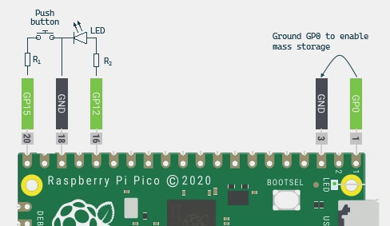

# mjig

Raspberry Pico based mouse jiggler, built on _CircuitPython_.\
\
Uses `adafruit_hid` module to emulate mouse movements.\
While plugged in, it's recognized as a HID device, unless special conditions
are met (see [special conditions](#special-conditions)).

## Installation
_____
First, download .UF2 file containing CircuitPython (https://circuitpython.org/board/raspberry_pi_pico/) and follow instructions.\
After installation succeeded, drag and drop all `.py` files from this repo into the root catalog of your Pico.\
That's it!

## Build
_____

### __Bare minimum (no LED activity):__
- 1 push button
- 1 resistor (optional)

Connect the push button to __GP15__ and ground.
Allows to toggle the jiggler on/off.\
Use resistor to limit the current passed through the button.

### __Full build:__
- 1 push button
- 1 LED
- 2 resistors

Connect the push button to __GP15__ and ground through a resistor. Allows to toggle the jiggler on/off.\
Connect the LED to __GP12__ and ground through a resistor. The LED indicates, whether the jiggler is enabled or not.

## Special Conditions
_____
While using _CircuitPython_, Pico's mass storage is enabled by default,
and a window pops up everytime Pico's plugged in. \
To avoid that, the mass storage is disabled by default.\
\
If you're stuck and want to access the storage, you can either:
- Ground GP0 before connecting the Pico to PC,
- Press the switch connected to GP15 while plugging Pico to PC.

## Disclaimer
_____
The contents of this repository are provided "AS IS".\
By using any part of this repository (code, instructions, etc.), you agree that you do it at your own risk.\
You acknowledge that working with electrical devices is hazardous, and that they should be handled cautiously and with no negligence.\
I am not responsible for any damage to the equipment or injuries.